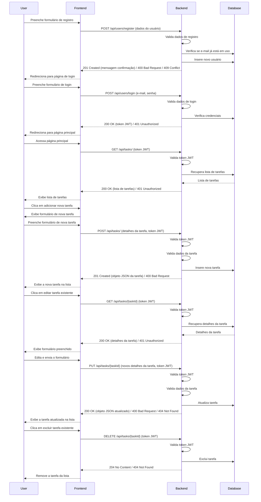

<h3 align="center">
    
</h3>

<h1 align="center">📝 TASKFY</h1>

<h3 align="center">Um sistema em .NET para gerenciamento de tarefas</h3>

  
  
  

<h4 align="center">
   Status: Concluído 🚀
</h4>

---

## 📋 Índice
- [Visão Geral](#-visão-geral)
- [Documentação](#%EF%B8%8F-documentação)
- [Diagrama de Sequência do sistema](#-diagrama-de-sequência-do-sistema)
- [Funcionalidades](#%EF%B8%8F-funcionalidades)
- [Testes](#-testes)
- [Tecnologias utilizadas](#%EF%B8%8F-tecnologias-utilizadas)
- [Autor](#-autor)

---

## 💻 Visão Geral

Uma Web API desenvolvida em .NET 8 para o gerenciamento de tarefas e autenticação de usuários. Ela permite a criação, atualização, consulta e exclusão de tarefas, bem como o registro e login de usuários, e inclui um sistema de logs e tratamento de erros.

---

## 📚 Documentação
- Para visualizar a documentação de todas as rotas da API, [clique aqui](https://taskfy.apidocumentation.com/)

---

## 🧩 Diagrama de Sequência do sistema

---

## ⚙️ Funcionalidades

- **Registro de Usuário**: Permite que novos usuários se registrem na aplicação utilizando nome de usuário, e-mail e senha.
- **Login de Usuário**: Autentica com e-mail e senha usuários já registrados.
- **CRUD de Tarefas**: Permite que usuários criem, busquem, atualizem e excluam suas tarefas.
- **Middleware Global de Erros**: Captura e trata erros, fornecendo respostas adequadas ao cliente e registrando logs.
- **Sistema de Logs**: Monitora e registra erros e eventos importantes na aplicação.

---

## 🧪 Testes
A aplicação inclui uma suíte de testes unitários utilizando o xUnit, cobrindo todos os casos relevantes nos controllers e services de usuários e tarefas.
- **Total de Testes**: 41
- **Cobertura**: Controllers e Services de Usuários e Tarefas

---

## 🛠️ Tecnologias utilizadas

### Aplicação:
- .NET 8
- Entity Framework Core
- AspNetCore Identity
- JWT
- AutoMapper
- Swagger

### Banco de dados:
- SQL Server

### Testes unitários:
- xUnit
- NSubstitute
- FluentAssertions

---

## 🧑‍💻 Autor

Esse projeto foi desenvolvido por:

<table>
  <tr>
    <td align="center"><a href="https://www.linkedin.com/in/paulo-ricardo-magalh%C3%A3es/"> <b>Paulo Ricardo</b></a> </td>
  </tr>
</table>

